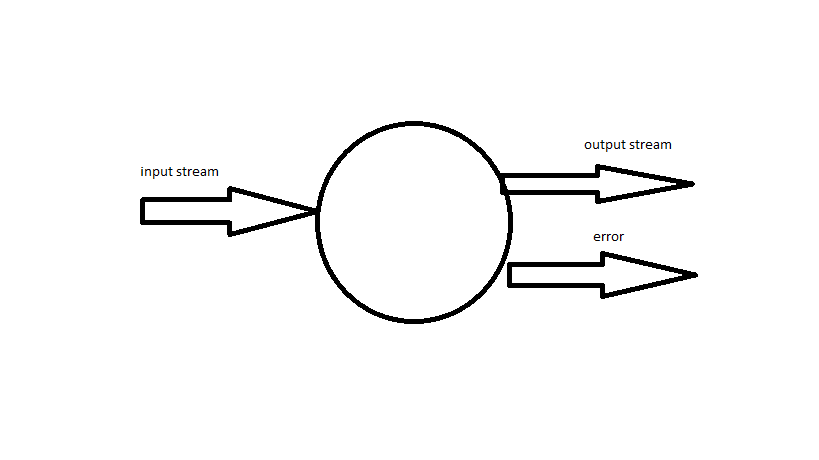
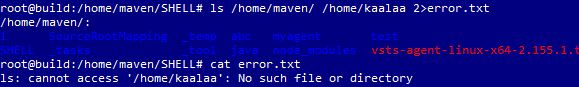

##  Shell Intro
####    to know the default login shell
    cat /etc/passwd
    sudo -i
    nano /etc/passwd
            to remove user from login access
        maven:x:1001:1001:Ubuntu:/home/maven:/usr/sbin/nologin
            to add user to login access
        maven:x:1001:1001:Ubuntu:/home/maven:/bin/bash

####    ps $$
        give you the current shell
        give you the bash pid

####    To install ZSH in ubuntu
        >> sudo apt-get installl zsh -y

####    To install ZSH in redhat
        >> sudo yum installl zsh -y

* Shell standard streams

* output streams
        * STDOUT
        * STDERR

* Redirecting __Standard output__ stream file 
    * commnad > (where to send the output)
    * Example
        * echo "hello" > /home/maven/SHELL/hello.txt

* Redirecting __Error output__ stream to other [hear file]
    * Example
        * ls /home/maven/ 2>error.txt /home/kaala
* Note:
    * above Example genrates a new error.txt file with error content if __kaala__ directory is not present

